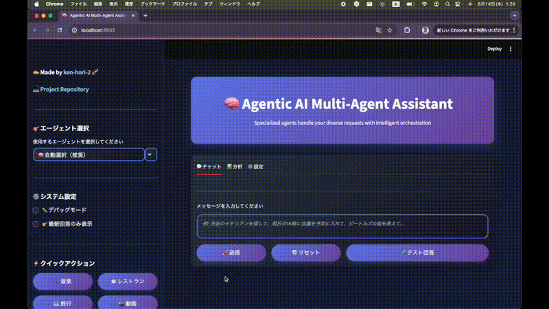
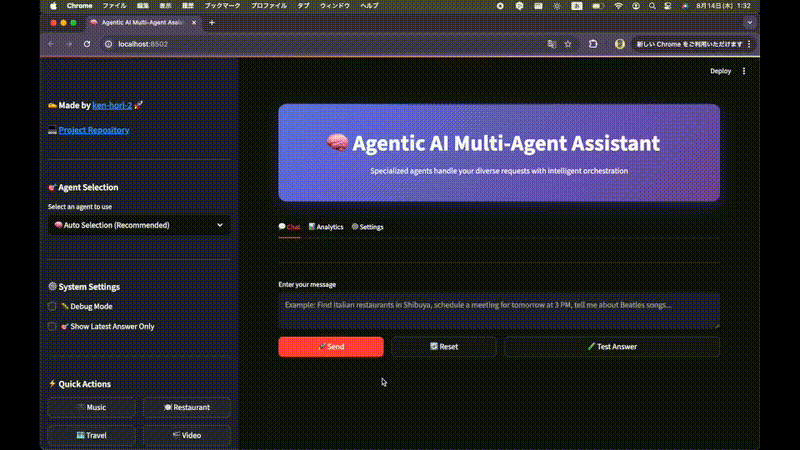
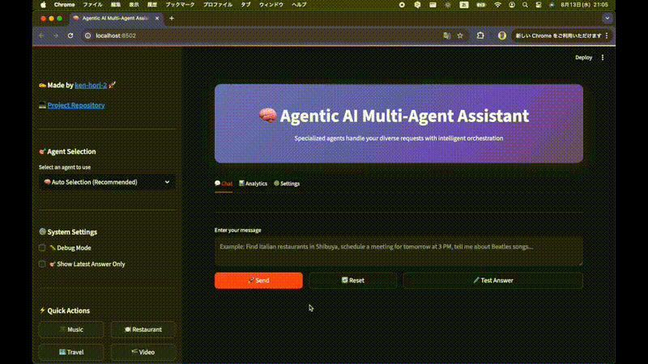
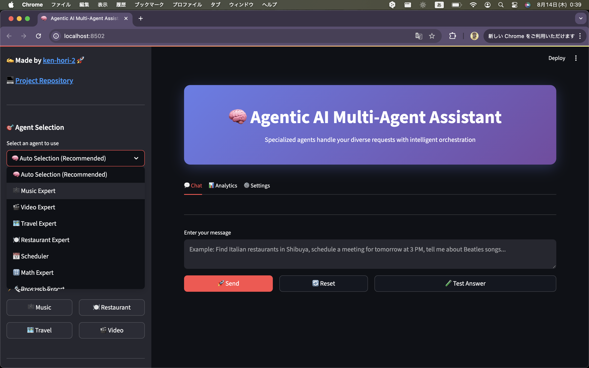
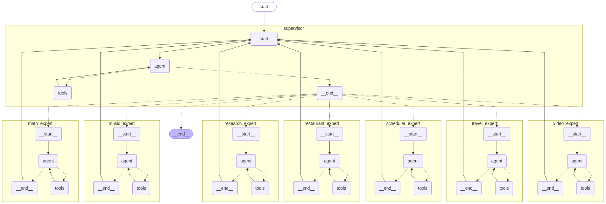

# 🚀 LangGraph Agentic System Hub

> **統合型AIエージェントシステム** - LangGraphとMCPツールを活用したマルチエージェント・マルチインターフェースフレームワーク

[](https://python.org)
[](https://langchain-ai.github.io/langgraph/)
[](https://streamlit.io)
[](https://fastapi.tiangolo.com/)
[](https://modelcontextprotocol.io)
[](https://openai.com)
[](https://openai.com)
[](https://anthropic.com)
[](https://anthropic.com)
[](LICENSE)

## 📋 目次

- [🎯 概要](#概要)
- [🏗️ システム構成](#システム構成)
- [🔧 コンポーネント詳細](#コンポーネント詳細)
- [🤖 マルチエージェントシステム](#マルチエージェントシステム)
- [⚙️ セットアップ](#セットアップ)
- [🎮 使用方法](#使用方法)
- [🔌 API統合](#api統合)
- [🔧 トラブルシューティング](#トラブルシューティング)
- [📝 ライセンス](#ライセンス)

## 🎯 概要

LangGraph Agentic System Hubは、**LangGraphベースのエージェントアーキテクチャ**を提供し、**MCP（Model Context Protocol）** ツールを統合して、インテリジェントで動的なタスク実行を可能にする統合システムです。

### 🌟 主な特徴

- **🤖 マルチエージェント**: 7つの専門エージェントが協調動作
- **💻 マルチインターフェース**: CLI、GUI、API、MCP統合
- **🔧 モジュラー設計**: 拡張可能で再利用可能なコンポーネント
- **🎯 専門分野**: 各エージェントが特定のタスクに特化
- **🔄 自動振り分け**: スーパーバイザーが最適なエージェントを自動選択
- **🤖 多モデル対応**: OpenAI GPT-4o、Anthropic Claude-3シリーズ対応

## 🎮 デモ

### 🎥 デモ動画

<div align="center">

**🎬 マルチエージェントシステムの動作デモ**

> 尺の都合上二つの動画に分けていますが、アプリを切り替えることなくそれぞれのユースケースに対応可能です。  
> UIが英語版と日本語版で異なるのはわかりやすくするためと、試行錯誤中のためです。

*音楽検索、レストラン検索、スケジュール管理など、複数の専門エージェントが協調して動作する様子をご覧いただけます。*

---

### 📹 デモ動画1: 居酒屋検索 × 音楽推薦



*居酒屋検索と音楽推薦のプレビュー - より詳しく見るには下のボタンをクリック*

[](https://github.com/user-attachments/assets/90717585-5e53-492d-a558-035fe871605c)

*このデモでは、ユーザーが「渋谷でオシャレな居酒屋を探して、ミセスの曲を教えて」と質問すると、Restaurant AgentやMusic Agent等と協調して回答を生成します。*

---

### 📹 デモ動画2: 動画検索 × 天気情報



*動画検索と天気情報のプレビュー - より詳しく見るには下のボタンをクリック*

[](https://github.com/user-attachments/assets/d4fe73d3-727b-487c-9826-a6a18e4b2a79)

*このデモでは、ユーザーが「英語の勉強用の動画コンテンツを探して、明日の天気を教えて」と質問すると、Video AgentやWeather Agent等と協調して回答を生成します。*

---

<!-- ### 🎞️ 統合システムデモ



*統合システムのプレビュー - より詳しく見るには下のボタンをクリック*

[](src/langgraph-supervisor/assets/demo.mp4)

*全機能を統合した包括的なデモンストレーションです。*

--- -->

</div>

### 🌐 Webアプリケーション

マルチエージェントシステムのWebインターフェースを体験できます：



#### 🚀 起動方法

```bash
# GUIディレクトリに移動
cd src/langgraph-supervisor/gui

# 日本語版アプリケーション起動
streamlit run streamlit_app.py

# 英語版アプリケーション起動
streamlit run streamlit_app_en.py

# ポート指定で起動（例：8501）
streamlit run streamlit_app.py --server.port 8501

# 外部アクセス許可で起動
streamlit run streamlit_app.py --server.address 0.0.0.0
```

#### ✨ 主な機能

- **🤖 7つの専門エージェント**: 自動選択または手動選択
- **💬 リアルタイムチャット**: 自然な対話形式
- **📊 結果可視化**: レストラン、音楽、動画などの検索結果
- **🎯 クイックアクション**: ワンクリックでエージェント切り替え
- **📈 アナリティクス**: 会話履歴とパフォーマンス分析
- **⚙️ デバッグモード**: 詳細な処理情報表示

#### 🎯 使用例

```
ユーザー: "渋谷でイタリアンを探して、ビートルズの曲も教えて"
→ システム: 自動的にRestaurant AgentとMusic Agentを選択
→ 結果: レストラン情報 + Spotify埋め込みプレイヤー
```

## 🏗️ システム構成

このリポジトリは**4つの主要コンポーネント**で構成されています：

### 📁 プロジェクト構造

```
langgraph-agentic-system-hub/
├── 📁 src/
│   ├── 📁 simple-agent-mcp/           # シンプルなReActエージェント
│   │   ├── planner_agent.py          # メインエージェント
│   │   └── 📁 tools/                 # MCPサーバー群
│   │       ├── mcp_server_time.py
│   │       ├── mcp_server_search.py
│   │       └── mcp_server_spotify.py
│   │
│   ├── 📁 streamlit-mcp-server-src/   # StreamlitベースのMCPサーバーUI
│   │   ├── 📁 mcp_chat/              # MCPチャットアプリケーション
│   │   │   ├── main.py               # メイン実行ファイル
│   │   │   ├── app.py                # 基本アプリケーション
│   │   │   ├── config.json           # 設定ファイル
│   │   │   ├── utils.py              # ユーティリティ関数
│   │   │   └── 📁 tools/             # MCPサーバー群
│   │   │       ├── mcp_server_time.py    # 時刻サーバー
│   │   │       ├── mcp_server_search.py  # 検索サーバー
│   │   │       ├── mcp_server_spotify.py # Spotifyサーバー
│   │   │       ├── mcp_server_googlemaps.py # Google Mapsサーバー
│   │   │       ├── mcp_server_rag.py     # RAGサーバー
│   │   │       └── mcp_server_weather.py # 天気サーバー
│   │   │
│   │   └── 📁 mcp_integration/       # MCP統合アプリケーション
│   │       ├── app_integrated_main.py # メイン実行ファイル
│   │       ├── app.py                # 基本アプリケーション
│   │       ├── requirements_app_integrated.txt # 依存関係
│   │       ├── README.md             # 詳細ドキュメント
│   │       ├── config.json           # 設定ファイル
│   │       ├── utils.py              # ユーティリティ関数
│   │       └── 📁 tools/             # MCPサーバー群
│   │           ├── mcp_server_time.py    # 時刻サーバー
│   │           ├── mcp_server_spotify.py # Spotifyサーバー
│   │           ├── mcp_server_googlemaps.py # Google Mapsサーバー
│   │           ├── mcp_server_hotpepper.py # HotPepperサーバー
│   │           └── mcp_server_search.py  # 検索サーバー
│   │
│   ├── 📁 uv-agent-api/               # FastAPIベースのエージェントAPI
│   │   ├── uv_api_agent.py
│   │   ├── uv_api_main.py
│   │   └── uv_api_client.py
│   │
│   └── 📁 langgraph-supervisor/       # 🆕 マルチエージェントスーパーバイザー
│       ├── 📁 cli/                   # コマンドラインインターフェース
│       │   ├── README.md             # CLI使用ガイド
│       │   ├── supervisor_workers_multiagents.py
│       │   ├── requirements.txt
│       │   └── architecture.html     # アーキテクチャ図
│       │
│       ├── 📁 gui/                   # グラフィカルユーザーインターフェース
│       │   ├── README.md             # GUI使用ガイド
│       │   ├── streamlit_app.py      # 日本語版メインアプリケーション
│       │   ├── streamlit_app_en.py   # 英語版メインアプリケーション
│       │   ├── supervisor_workers_multiagents.py
│       │   ├── requirements.txt
│       │   ├── setup.sh              # macOS/Linux用セットアップスクリプト
│       │   └── setup.bat             # Windows用セットアップスクリプト
│       │
│       ├── 📁 assets/                 # アセットファイル
│       │   ├── demo_en.mp4           # 英語版デモ動画
│       │   ├── demo_ja.mp4           # 日本語版デモ動画
│       │   ├── demo_en.gif           # 英語版デモGIF
│       │   ├── demo_ja.gif           # 日本語版デモGIF
│       │   ├── demo.mp4              # 統合デモ動画
│       │   ├── demo.gif              # 統合デモGIF
│       │   ├── web_ja.png            # 日本語版Webアプリ画像
│       │   ├── web_en.png            # 英語版Webアプリ画像
│       │   ├── web_gui.png           # Webアプリ画像
│       │   └── workflow.png          # ワークフロー図
│       │
│       ├── README.md                 # 詳細ドキュメント
│       └── LICENSE                   # ライセンスファイル
│
├── 📁 docs/
│   └── architecture.png
├── requirements.txt
└── README.md
```

## 🔧 コンポーネント詳細

### 1. 🎯 Simple ReAct Agent (`simple-agent-mcp/`)

**シンプルなReActエージェント** - MCPツールを統合した単一のReActエージェント

#### 特徴
- **MCPツール統合**: 複数のMCPサーバーとの統合
- **ReAct推論**: ツール使用と推論の組み合わせ
- **シンプルな対話**: コマンドラインでの直接対話
- **基本機能**: 音楽検索、Web検索、時刻取得

#### 使用例
```bash
# MCPサーバー起動
python src/simple-agent-mcp/tools/mcp_server_spotify.py
python src/simple-agent-mcp/tools/mcp_server_search.py
python src/simple-agent-mcp/tools/mcp_server_time.py

# エージェント起動
python src/simple-agent-mcp/planner_agent.py
```

### 2. 🌐 Streamlit MCP Server Interface (`streamlit-mcp-server-src/`)

**ユーザーフレンドリーなWebインターフェース** - MCPツールとReActエージェントの統合

#### 特徴
- **🎯 ReActエージェント**: 複数ツールを使用するインテリジェントエージェント
- **🔧 動的ツール管理**: WebインターフェースでのMCPツール追加・設定
- **🗺️ Google Maps統合**: ルート検索、場所検索、ジオコーディング
- **🔍 Web検索**: Tavily検索APIによる高度な検索
- **🎵 Spotify統合**: 音楽検索・推薦
- **⏰ 時刻サービス**: 異なるタイムゾーンの現在時刻
- **📚 RAGサポート**: ドキュメントベースの質問応答
- **🔐 認証システム**: セキュアアクセスのためのログイン機能
- **💬 リアルタイムストリーミング**: ツール呼び出し情報付きのライブレスポンス

#### フォルダ構成
- **📁 mcp_chat/**: MCPチャットアプリケーション（ReActエージェント）
- **📁 mcp_integration/**: MCP統合アプリケーション（統合機能）

#### 使用例
```bash
# MCPチャットアプリケーション
cd src/streamlit-mcp-server-src/mcp_chat
streamlit run main.py

# MCP統合アプリケーション
cd src/streamlit-mcp-server-src/mcp_integration
streamlit run app_integrated_main.py
```

### 3. 🔌 FastAPI Multi-Agent Extensible API (`uv-agent-api/`)

**LangGraph StateGraphベースのエージェントシステム** - 拡張可能なアーキテクチャ

#### 特徴
- **StateGraphベース**: LangGraphによる状態管理
- **RESTful API**: 標準HTTPエンドポイント
- **プログラムアクセス**: 既存アプリケーションとの簡単統合
- **会話管理**: 組み込みの会話履歴と状態管理
- **スケーラブルアーキテクチャ**: パフォーマンス向上のためのクライアント-サーバー分離

#### 使用例
```bash
# サーバー起動
cd src/uv-agent-api
uvicorn uv_api_main:app --reload --port 8001

# クライアント使用
python uv_api_client.py
```

### 4. 🤖 マルチエージェントスーパーバイザー (`langgraph-supervisor/`) 🆕

**7つの専門エージェントが協調する高度なマルチエージェントシステム**

#### 特徴
- **🤖 マルチエージェント**: 7つの専門エージェントが協調動作
- **🎯 専門分野**: 各エージェントが特定のタスクに特化
- **🔄 自動振り分け**: スーパーバイザーが最適なエージェントを自動選択
- **💻 多様なインターフェース**: CLI、GUI、MCPツール統合
- **🤖 多モデル対応**: OpenAI GPT-4o、Anthropic Claude-3シリーズ対応

#### エージェント構成

<div align="center">

#### 🎯 スーパーバイザー層
**Task Router & Coordinator** - リクエスト解析・エージェント選択・結果統合

#### 🤖 エージェント層

| エージェント | 専門分野 | 対応API | 主要機能 |
|-------------|---------|---------|----------|
| 📅 **Scheduler Agent** | スケジュール管理 | Google Calendar API | 予定追加・管理・相対日付処理 |
| 🎵 **Music Agent** | 音楽検索・推薦 | Spotify API | 楽曲・アーティスト・プレイリスト検索 |
| 🍽️ **Restaurant Agent** | レストラン検索 | HotPepper + Google Maps | 統合検索・評価・地図表示 |
| 🎬 **Video Agent** | 動画検索 | YouTube Data API | 動画検索・情報取得・メタデータ |
| 🏨 **Travel Agent** | 旅行プランニング | Jalan.net + Airbnb | ホテル・宿泊施設検索 |
| 🔢 **Math Agent** | 数学計算 | - | 高度な数学処理・計算 |
| 🔍 **Research Agent** | 情報収集 | Tavily Search | Web検索・リサーチ・情報整理 |

</div>

#### 使用例
```bash
# CLIインターフェース
python src/langgraph-supervisor/cli/supervisor_workers_multiagents.py

# GUIインターフェース
streamlit run src/langgraph-supervisor/gui/streamlit_app.py

# スクリプト実行
python -c "
from src.langgraph-supervisor.cli.supervisor_workers_multiagents import app
result = app.invoke({'messages': [{'role': 'user', 'content': '明日の15時に会議を予定に入れて'}]})
print(result['messages'][-1]['content'])
"
```

## 🤖 マルチエージェントシステム

### ワークフロー図



### スーパーバイザーの役割

スーパーバイザーは以下の機能を提供します：

<div align="center">

| 🎯 **タスク分析** | 🤖 **エージェント選択** | 🔄 **協調管理** |
|-------------------|-------------------------|-----------------|
| ユーザーのリクエストを分析 | 最適な専門エージェントを自動選択 | 複数エージェントの協調動作を管理 |

| 📊 **結果統合** | ⚡ **パフォーマンス最適化** |
|-----------------|---------------------------|
| 各エージェントの結果を統合・整理 | 効率的なタスク実行 |

</div>

### エージェント間の協調

```
ユーザーリクエスト → スーパーバイザー → 専門エージェント選択 → タスク実行 → 結果統合 → レスポンス
```

## ⚙️ セットアップ

### 1. 環境要件

```bash
Python 3.8+
Streamlit 1.28+ (GUI使用時)
```

### 2. 依存関係のインストール

```bash
# 基本依存関係
pip install -r requirements.txt

# マルチエージェントシステム用
pip install -r src/langgraph-supervisor/requirements.txt

# GUI使用時
pip install -r src/langgraph-supervisor/gui/requirements.txt
```

### 3. 環境変数の設定

`.env`ファイルを作成し、以下のAPIキーを設定：

```env
# ===== LLM API Keys =====
OPENAI_API_KEY=your_openai_api_key_here
ANTHROPIC_API_KEY=your_anthropic_api_key_here

# ===== Tool API Keys =====
# Tavily Search API (for web search)
TAVILY_API_KEY=your_tavily_api_key_here

# Spotify API (for music search)
SPOTIFY_USER_ID=your_spotify_user_id_here
SPOTIFY_TOKEN=your_spotify_token_here
SPOTIFY_CLIENT_ID=your_spotify_client_id_here
SPOTIFY_CLIENT_SECRET=your_spotify_client_secret_here

# Google APIs
GOOGLE_MAPS_API_KEY=your_google_maps_api_key_here
GOOGLE_SERVICE_ACCOUNT_FILE=path/to/service_account.json
GOOGLE_CALENDAR_ID=your_calendar_id

# HotPepper Gourmet API
RECRUIT_API_KEY=your_recruit_api_key

# YouTube API
YOUTUBE_API_KEY=your_youtube_api_key

# Google Search API (for uv-agent-api)
GOOGLE_API_KEY=your_google_api_key_here
GOOGLE_CSE_ID=your_google_cse_id_here

# ===== Optional Settings =====
# Authentication (for Streamlit interface)
USE_LOGIN=true
USER_ID=your_username
USER_PASSWORD=your_password
```

### 4. APIキーの取得方法

<div align="center">

| API | 取得方法 | リンク |
|-----|----------|--------|
| **OpenAI API** | OpenAIアカウントでAPIキーを生成 | [OpenAI Platform](https://platform.openai.com/api-keys) |
| **Anthropic API** | AnthropicアカウントでAPIキーを生成 | [Anthropic Console](https://console.anthropic.com/) |
| **Tavily API** | Tavilyで無料アカウントを作成 | [Tavily API](https://tavily.com/) |
| **Google Custom Search** | Google Cloud ConsoleでCustom Search APIを有効化 | [Google Custom Search](https://developers.google.com/custom-search/v1/overview) |
| **Google Maps API** | Google Cloud ConsoleでMaps APIを有効化 | [Google Maps Platform](https://developers.google.com/maps/documentation/javascript/get-api-key) |
| **Hotpepper API** | リクルートWEBサービスでアカウントを作成 | [Hotpepper API](https://webservice.recruit.co.jp/doc/hotpepper/) |
| **Spotify API** | Spotify Developerでアプリを作成 | [Spotify Developer](https://developer.spotify.com/documentation/web-api) |

</div>

## 🎮 使用方法

### 🖥️ CLI インターフェース（マルチエージェント）

```bash
# マルチエージェントシステムの起動
python src/langgraph-supervisor/cli/supervisor_workers_multiagents.py

# スクリプト実行
python -c "
from src.langgraph-supervisor.cli.supervisor_workers_multiagents import app
result = app.invoke({'messages': [{'role': 'user', 'content': '明日の15時に会議を予定に入れて'}]})
print(result['messages'][-1]['content'])
"
```

### 🌐 GUI インターフェース（マルチエージェント）

```bash
# Streamlitアプリケーション起動
streamlit run src/langgraph-supervisor/gui/streamlit_app.py

# 英語版アプリケーション起動
streamlit run src/langgraph-supervisor/gui/streamlit_app_en.py

# ポート指定で起動
streamlit run src/langgraph-supervisor/gui/streamlit_app.py --server.port 8501

# 外部アクセス許可で起動
streamlit run src/langgraph-supervisor/gui/streamlit_app.py --server.address 0.0.0.0
```

### 🎯 Simple ReAct Agent

```bash
# MCPサーバー起動
python src/simple-agent-mcp/tools/mcp_server_spotify.py
python src/simple-agent-mcp/tools/mcp_server_search.py
python src/simple-agent-mcp/tools/mcp_server_time.py

# エージェント起動
python src/simple-agent-mcp/planner_agent.py
```

### 🌐 Streamlit Interface

```bash
# MCPチャットアプリケーション
cd src/streamlit-mcp-server-src/mcp_chat
streamlit run main.py

# MCP統合アプリケーション
cd src/streamlit-mcp-server-src/mcp_integration
streamlit run app_integrated_main.py
```

### 🔌 FastAPI Multi-Agent API

```bash
# サーバー起動
cd src/uv-agent-api
uvicorn uv_api_main:app --reload --port 8001

# クライアント使用
python uv_api_client.py
```

## 🔌 API統合

### 利用可能なツール

#### 🗺️ Google Maps API
- ルート検索と方向案内
- 評価・営業時間付きの場所検索
- ジオコーディング（住所→座標）
- 逆ジオコーディング（座標→住所）

#### 🔍 Web検索
- Tavily APIによる高度なWeb検索
- 設定可能な検索深度
- URL付きの豊富な検索結果

#### 🎵 Spotify検索
- 音楽検索と推薦
- アーティスト・アルバム情報
- トラック詳細と音声特徴

#### ⏰ 時刻サービス
- 任意のタイムゾーンの現在時刻
- タイムゾーン変換
- フォーマットされた時刻出力

#### 📚 RAG（Retrieval-Augmented Generation）
- ドキュメントベースの質問応答
- PDFドキュメント処理
- コンテキストを考慮したレスポンス

### マルチエージェントAPI統合例

```python
# 基本的な使用方法
from src.langgraph-supervisor.cli.supervisor_workers_multiagents import app

# ユーザーリクエストの実行
result = app.invoke({
    "messages": [
        {
            "role": "user",
            "content": "明日の15時に会議を予定に入れて"
        }
    ]
})

print(result["messages"][-1]["content"])
```

## 🔄 コンポーネント比較

<div align="center">

| 機能 | Simple ReAct Agent | Streamlit Interface | FastAPI Multi-Agent API | マルチエージェントスーパーバイザー |
|------|-------------------|-------------------|------------------------|--------------------------------|
| **ユーザーインターフェース** | コマンドライン | Web UI | REST API | CLI, GUI, MCP |
| **複雑さ** | 低（単一ReAct） | 中（ReAct） | 高（StateGraph） | 最高（マルチエージェント） |
| **使用例** | 基本機能 | 対話型使用 | 統合・拡張 | 複雑なタスク処理 |
| **セットアップ** | 複数サーバー | 単一アプリ | クライアント-サーバー | 統合システム |
| **スケーラビリティ** | 低 | 中 | 高 | 最高 |
| **学習曲線** | 緩やか | 緩やか | 急 | 中 |
| **マルチエージェントサポート** | なし | なし | 拡張可能 | 完全対応 |

</div>

## 🧩 エージェントワークフロー例

### マルチエージェントシステム例

```txt
ユーザー: "週末の予定を立てて、渋谷でイタリアンを探して、ビートルズの曲も教えて"
→ スーパーバイザー: タスクを分析・分割
→ Scheduler Agent: 週末の予定を管理
→ Restaurant Agent: 渋谷のイタリアンを検索
→ Music Agent: ビートルズの曲を検索
→ スーパーバイザー: 結果を統合・整理
→ ユーザー: 統合された結果を受信
```

### シンプルReActエージェント例

```txt
ユーザー: "週末に行く場所を探して"
→ Orchestrator: "PlannerAgent"に振り分け
→ PlannerAgent: Web検索MCPを使用
→ Google Maps MCP + HotPepper MCPから情報取得
→ LangGraph経由でユーザーに結果を返す
```

## 🔮 今後の計画

- 🧠 LangChainメモリとの統合
- 🔍 動的検索のためのRAG（Retrieval-Augmented Generation）
- 📆 自動スケジュール管理のためのGoogle Calendar統合
- 📎 Notion自動要約機能
- 🎤 YouTube音声分離ツールとの統合
- 💬 各エージェントのプロンプト最適化
- 🗺️ LangGraph SDKによる視覚的ワークフロー生成

## ✨ 使用例

<div align="center">

| 使用例 | 説明 | 対応コンポーネント |
|--------|------|-------------------|
| 🎵 音楽検索 | ユーザーのリクエストに基づいてSpotifyから楽曲を検索・推薦 | 全コンポーネント |
| 🍺 パーティ会場探し | 人数・日付・エリアに基づいて良い会場を探し、空き状況を確認 | マルチエージェント |
| 🌤 天気情報 | 現在地または指定場所の天気情報を取得し、アドバイスを提供 | 全コンポーネント |
| 📆 タスク管理 | Google Calendar統合によるスケジュールとToDoリスト管理 | マルチエージェント |
| 📍 お出かけアイデア | 人気の週末スポットを提案し、レビューを取得 | 全コンポーネント |
| 🗺️ ルート計画 | Google Maps APIを使用した詳細な方向案内とルート情報 | 全コンポーネント |
| 🔍 Webリサーチ | 情報収集のための包括的なWeb検索 | 全コンポーネント |

</div>

## 🔧 トラブルシューティング

### よくある問題

#### 1. API認証エラー

```bash
# エラー: API credentials not configured
# 解決: .envファイルにAPIキーを正しく設定
echo "OPENAI_API_KEY=your_key" >> .env
echo "ANTHROPIC_API_KEY=your_key" >> .env
```

#### 2. 依存関係エラー

```bash
# エラー: ModuleNotFoundError
# 解決: 依存関係をインストール
pip install -r requirements.txt
pip install -r src/langgraph-supervisor/requirements.txt
```

#### 3. ポート競合エラー

```bash
# エラー: Port already in use
# 解決: 別のポートを使用
streamlit run app.py --server.port 8502
uvicorn main:app --port 8002
```

### デバッグモード

```python
# 詳細ログの有効化
import logging
logging.basicConfig(level=logging.DEBUG)

# 詳細なエラー情報を取得
try:
    result = app.invoke({"messages": [{"role": "user", "content": "test"}]})
except Exception as e:
    print(f"エラー詳細: {e}")
    import traceback
    traceback.print_exc()
```

## 👤 作者

**Centaurus-Ken（[@ken-hori-2](https://github.com/ken-hori-2)）**

LangGraph × MCPを使用したAgentic AIシステムの実験を行う開発者。  
アイデアからデモ開発、プレゼンテーションまで、音楽、天気、パーティ企画、スケジュール管理などの実用的なユースケースに焦点を当てています。  
エッジAIモデル設計、デモ開発、CI/CDパイプライン自動化の経験もあります。

## 📄 ライセンス

MIT License.

モジュラー型ツールオーケストレーションによる次世代LLMアプリケーションの探索のために、Centaurus-Kenによって作成されました。

---

<div align="center">

**⭐️ このプロジェクトが役に立ったら、スターを付けてください！**

</div>