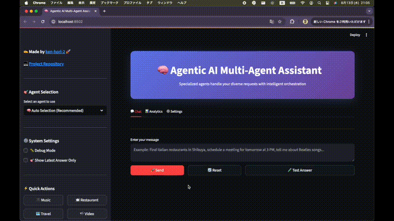

# 🧠 Agentic AI Multi-Agent Assistant
> Powered by LangGraph Multi-Agent Supervisor System
<!-- # 🤖 LangGraph Multi-Agent Supervisor System -->

<div align="center">

[](https://python.org)
[](https://langchain-ai.github.io/langgraph/)
[](https://streamlit.io)
[](https://modelcontextprotocol.io)
[](https://openai.com)
[](https://openai.com)
[](https://anthropic.com)
[](https://anthropic.com)
[](LICENSE)

**🚀 マルチエージェントAIシステム** - 7つの専門エージェントが協調して複雑なタスクを処理する統合システム

[English](#english) | [日本語](#japanese)

</div>

---

## 📋 目次

- [🎯 概要](#-概要)
- [🌟 主な特徴](#-主な特徴)
- [🤖 マルチエージェントシステム](#-マルチエージェントシステム)
- [🏗️ システム構成](#️-システム構成)
- [🚀 機能一覧](#-機能一覧)
- [🤖 対応モデル](#-対応モデル)
- [⚙️ セットアップ](#️-セットアップ)
- [🎮 使用方法](#-使用方法)
- [📁 ディレクトリ構成](#-ディレクトリ構成)
- [🔌 API統合](#-api統合)
- [🔧 トラブルシューティング](#-トラブルシューティング)
- [📝 ライセンス](#-ライセンス)

---

## 🎯 概要

LangGraph Multi-Agent Supervisor Systemは、**7つの専門エージェント**が協調して複雑なタスクを処理する高度なマルチエージェントシステムです。各エージェントが専門分野を持ち、スーパーバイザーが適切なエージェントを選択・実行します。

## 🎥 デモ動画

<div align="center">

**🎬 マルチエージェントシステムの動作デモ（高品質版）**

*音楽検索、レストラン検索、スケジュール管理など、複数の専門エージェントが協調して動作する様子をご覧いただけます。*

---

### 📹 デモ動画1: 居酒屋検索 × 音楽推薦


*居酒屋検索と音楽推薦のプレビュー - より詳しく見るには下のボタンをクリック*

[](./assets/demo_ja.mp4)

*このデモでは、ユーザーが「渋谷でオシャレな居酒屋を探して、ミセスの曲を教えて」と質問すると、Restaurant AgentやMusic Agent等と協調して回答を生成します。*

---

### 📹 デモ動画2: 動画検索 × 天気情報


*動画検索と天気情報のプレビュー - より詳しく見るには下のボタンをクリック*

[](./assets/demo_en.mp4)

*このデモでは、ユーザーが「英語の勉強用の動画コンテンツを探して、明日の天気を教えて」と質問すると、Video AgentやWeather Agent等と協調して回答を生成します。*

---

<!-- ### 🎞️ 統合システムデモ



*統合システムのプレビュー - より詳しく見るには下のボタンをクリック*

[](./assets/demo.mp4)

*全機能を統合した包括的なデモンストレーションです。* -->

</div>

## 🌟 主な特徴

<div align="center">

| 🤖 **マルチエージェント** | 🎯 **専門分野** | 🔄 **自動振り分け** |
|---------------------------|-----------------|-------------------|
| 7つの専門エージェントが協調動作 | 各エージェントが特定のタスクに特化 | スーパーバイザーが最適なエージェントを自動選択 |

| 💻 **多様なインターフェース** | 🤖 **多モデル対応** | 🎵 **音楽検索** |
|------------------------------|-------------------|----------------|
| CLI、GUI、MCPツール統合 | OpenAI GPT-4o、Anthropic Claude-3シリーズ対応 | Spotify API統合による楽曲・アーティスト検索 |

| 🍽️ **レストラン検索** | 📅 **スケジュール管理** | 🏨 **旅行プランニング** |
|------------------------|------------------------|------------------------|
| HotPepper + Google Maps統合検索 | Googleカレンダーとの連携 | ホテル・宿泊施設検索 |

| 🎬 **動画検索** | 🔢 **数学計算** | 🔍 **情報収集** |
|-----------------|-----------------|-----------------|
| YouTube動画検索・情報取得 | 高度な数学処理 | Web検索・リサーチ機能 |

</div>

## 🤖 マルチエージェントシステム

### エージェント構成

このシステムは以下の**7つの専門エージェント**で構成されています：

```
┌─────────────────────────────────────────────────────────────┐
│                Multi-Agent Supervisor System                │
├─────────────────┬─────────────────┬─────────────────────────┤
│  📅 Scheduler   │  🎵 Music       │  🍽️ Restaurant         │
│     Agent       │    Agent        │     Agent               │
│                 │                 │                         │
│ • Google Calendar│ • Spotify API  │ • HotPepper API         │
│ • スケジュール管理│ • 楽曲検索      │ • Google Maps API       │
│ • 予定追加      │ • アーティスト   │ • レストラン検索        │
└─────────────────┴─────────────────┴─────────────────────────┘
                              │
                              ▼
┌─────────────────────────────────────────────────────────────┐
│                    Task Router & Coordinator                │
└─────────────────┬─────────────────┬─────────────────────────┘
                  │                 │
┌─────────────────▼─────────────────▼─────────────────────────┐
│  🎬 Video       │  🏨 Travel      │  🔢 Math & 🔍 Research  │
│    Agent        │    Agent        │      Agents             │
│                 │                 │                         │
│ • YouTube API   │ • Jalan.net     │ • 数学計算              │
│ • 動画検索      │ • Airbnb        │ • Web検索               │
│ • 情報取得      │ • 宿泊施設検索   │ • 情報収集              │
└─────────────────┴─────────────────┴─────────────────────────┘
```

### ワークフロー図

以下の図は、マルチエージェントシステムの詳細なワークフローを示しています：


**ワークフロー説明:**
- **スーパーバイザー**: 中央の黄色いボックスで、全体のプロセスを調整
- **7つの専門エージェント**: 下部の黄色いボックスで、各分野に特化
- **ツール連携**: 各エージェントが専用ツールを使用してタスクを実行
- **制御フロー**: スーパーバイザーが適切なエージェントを選択・実行

### エージェント詳細

<div align="center">

| エージェント | 専門分野 | 対応API | 主要機能 |
|-------------|---------|---------|----------|
| 📅 **Scheduler Agent** | スケジュール管理 | Google Calendar API | 予定追加・管理・相対日付処理 |
| 🎵 **Music Agent** | 音楽検索・推薦 | Spotify API | 楽曲・アーティスト・プレイリスト検索 |
| 🍽️ **Restaurant Agent** | レストラン検索 | HotPepper + Google Maps | 統合検索・評価・地図表示 |
| 🎬 **Video Agent** | 動画検索 | YouTube Data API | 動画検索・情報取得・メタデータ |
| 🏨 **Travel Agent** | 旅行プランニング | Jalan.net + Airbnb | ホテル・宿泊施設検索 |
| 🔢 **Math Agent** | 数学計算 | - | 高度な数学処理・計算 |
| 🔍 **Research Agent** | 情報収集 | Tavily Search | Web検索・リサーチ・情報整理 |

</div>

### スーパーバイザーの役割

スーパーバイザーは以下の機能を提供します：

<div align="center">

| 🎯 **タスク分析** | 🤖 **エージェント選択** | 🔄 **協調管理** |
|-------------------|-------------------------|-----------------|
| ユーザーのリクエストを分析 | 最適な専門エージェントを自動選択 | 複数エージェントの協調動作を管理 |

| 📊 **結果統合** | ⚡ **パフォーマンス最適化** |
|-----------------|---------------------------|
| 各エージェントの結果を統合・整理 | 効率的なタスク実行 |

</div>

## 🏗️ システム構成

### アーキテクチャ

```
┌─────────────────────────────────────────────────────────────┐
│                Multi-Agent Supervisor System                │
├─────────────────┬─────────────────┬─────────────────────────┤
│   CLI Interface │  GUI Interface  │   MCP Tool Integration  │
│                 │                 │                         │
│ • Command Line  │ • Streamlit UI  │ • Dynamic Tool Loading  │
│ • Interactive   │ • Web Interface │ • JSON Configuration    │
│ • Script Mode   │ • Real-time     │ • Protocol Support      │
└─────────────────┴─────────────────┴─────────────────────────┘
                              │
                              ▼
┌─────────────────────────────────────────────────────────────┐
│                    Agent Supervisor                         │
├─────────────────┬─────────────────┬─────────────────────────┤
│  Task Router    │   Agent Pool    │   Result Coordinator    │
│                 │                 │                         │
│ • Request Parse │ • 7 Specialists │ • Response Integration  │
│ • Agent Select  │ • Load Balance  │ • Quality Assurance     │
│ • Priority Mgmt │ • Failover      │ • Format Standardize    │
└─────────────────┴─────────────────┴─────────────────────────┘
                              │
                              ▼
┌─────────────────────────────────────────────────────────────┐
│                    External APIs & Services                 │
├─────────────┬─────────────┬─────────────┬───────────────────┤
│   Spotify   │   Google    │  HotPepper  │     YouTube       │
│     API     │    APIs     │    API      │      API          │
│             │             │             │                   │
│ • Music     │ • Maps      │ • Restaurant│ • Video Search    │
│ • Playlists │ • Calendar  │ • Reviews   │ • Information     │
│ • Artists   │ • Places    │ • Location  │ • Metadata        │
└─────────────┴─────────────┴─────────────┴───────────────────┘
```

### コンポーネント詳細

<div align="center">

| コンポーネント | 役割 | 技術スタック | 特徴 |
|---------------|------|-------------|------|
| **CLI Interface** | コマンドライン操作 | Python, Click | スクリプト実行・バッチ処理 |
| **GUI Interface** | Webインターフェース | Streamlit, CSS | リアルタイム・可視化 |
| **MCP Integration** | ツール統合管理 | MCP Protocol | 動的ツール追加 |
| **Agent Supervisor** | エージェント管理 | LangGraph | タスク振り分け・協調 |
| **Task Router** | タスク振り分け | LangGraph | インテリジェントルーティング |
| **Agent Pool** | エージェントプール | LangGraph | 並列処理・負荷分散 |
| **Result Coordinator** | 結果統合 | LangGraph | レスポンス統合・品質管理 |

</div>

## 🚀 機能一覧

### 🤖 エージェント機能

<div align="center">

| エージェント | 機能 | 対応API | インターフェース | 使用例 |
|-------------|------|---------|----------------|--------|
| 📅 **Scheduler Agent** | スケジュール管理・Googleカレンダー連携 | Google Calendar API | CLI, GUI | "明日の15時に会議を予定に入れて" |
| 🎵 **Music Agent** | 楽曲・アーティスト・プレイリスト検索 | Spotify API | CLI, GUI, MCP | "ビートルズの曲を教えて" |
| 🎬 **Video Agent** | YouTube動画検索・情報取得 | YouTube Data API | CLI, GUI | "料理の動画を探して" |
| 🏨 **Travel Agent** | ホテル・宿泊施設検索 | じゃらん・Airbnb | CLI, GUI | "東京のホテルを明日から2泊で探して" |
| 🍽️ **Restaurant Agent** | レストラン検索・予約確認 | ホットペッパーグルメ・Google Places | CLI, GUI, MCP | "渋谷のイタリアンを3000円以下で探して" |
| 🔢 **Math Agent** | 数学計算 | - | CLI, GUI | "15 × 23 を計算して" |
| 🔍 **Research Agent** | Web検索・情報収集 | Tavily Search | CLI, GUI, MCP | "最新のAI技術について調べて" |

</div>

### 💻 インターフェース機能

<div align="center">

| インターフェース | 特徴 | 用途 | 実行方法 |
|----------------|------|------|----------|
| **CLI** | コマンドライン操作・スクリプト実行 | 自動化・バッチ処理 | `python cli/supervisor_workers_multiagents.py` |
| **GUI** | Webインターフェース・リアルタイム可視化 | 対話型操作・データ可視化 | `streamlit run gui/streamlit_app.py` |
| **MCP** | 動的ツール追加・プロトコル統合 | 拡張性・カスタマイズ | MCPサーバー起動 |

</div>

## 🤖 対応モデル

<div align="center">

| モデル名 | プロバイダー | 最大トークン数 | 特徴 | 推奨用途 |
|---------|-------------|---------------|------|----------|
| **gpt-4o** | OpenAI | 16,000 | 高精度・高速処理 | 複雑なタスク・高品質な応答 |
| **gpt-4o-mini** | OpenAI | 16,000 | コスト効率・高速 | 日常的なタスク・コスト重視 |
| **claude-3-5-sonnet-latest** | Anthropic | 8,192 | バランス型 | 一般的なタスク・バランス重視 |
| **claude-3-5-haiku-latest** | Anthropic | 8,192 | 軽量・高速 | 簡単なタスク・高速処理 |
| **claude-3-7-sonnet-latest** | Anthropic | 64,000 | 高精度・長文対応 | 複雑な分析・長文処理 |

</div>

## ⚙️ セットアップ

### 1️⃣ 環境要件

```bash
Python 3.8+
Streamlit 1.28+ (GUI使用時)
```

### 2️⃣ 依存関係のインストール

```bash
# 基本依存関係（マルチエージェントシステム用）
pip install -r requirements.txt

# GUI使用時
pip install -r gui/requirements.txt
```

### 3️⃣ 環境変数の設定

`.env`ファイルを作成し、以下のAPIキーを設定：

```env
# OpenAI API (GPT-4o, GPT-4o-mini用)
OPENAI_API_KEY=your_openai_api_key

# Anthropic API (Claude-3シリーズ用)
ANTHROPIC_API_KEY=your_anthropic_api_key

# Google APIs
GOOGLE_MAPS_API_KEY=your_google_maps_api_key
GOOGLE_SERVICE_ACCOUNT_FILE=path/to/service_account.json
GOOGLE_CALENDAR_ID=your_calendar_id

# Spotify API
SPOTIFY_CLIENT_ID=your_spotify_client_id
SPOTIFY_CLIENT_SECRET=your_spotify_client_secret
SPOTIFY_USER_ID=your_spotify_user_id
SPOTIFY_TOKEN=your_spotify_token

# HotPepper Gourmet API
RECRUIT_API_KEY=your_recruit_api_key

# YouTube API
YOUTUBE_API_KEY=your_youtube_api_key

# Tavily Search API
TAVILY_API_KEY=your_tavily_api_key

# 認証設定（GUI使用時・オプション）
USE_LOGIN=false
USER_ID=admin
USER_PASSWORD=password
```

## 🎮 使用方法

### 🖥️ CLI インターフェース

```bash
# マルチエージェントシステムの直接実行
python cli/supervisor_workers_multiagents.py

# スクリプト実行例
python -c "
from cli.supervisor_workers_multiagents import app
result = app.invoke({'messages': [{'role': 'user', 'content': '明日の15時に会議を予定に入れて'}]})
print(result['messages'][-1]['content'])
"
```

### 🌐 GUI インターフェース

```bash
# Streamlitアプリケーション起動
streamlit run gui/streamlit_app.py

# 英語版アプリケーション起動
streamlit run gui/streamlit_app_en.py

# ポート指定で起動
streamlit run gui/streamlit_app.py --server.port 8501

# 外部アクセス許可で起動
streamlit run gui/streamlit_app.py --server.address 0.0.0.0
```

### 📝 使用例

```python
# 基本的な使用方法
from cli.supervisor_workers_multiagents import app

# ユーザーリクエストの実行
result = app.invoke({
    "messages": [
        {
            "role": "user",
            "content": "明日の15時に会議を予定に入れて"
        }
    ]
})

print(result["messages"][-1]["content"])
```

## 📁 ディレクトリ構成

```
langgraph-supervisor/
├── 📁 cli/                    # コマンドラインインターフェース
│   ├── README.md             # CLI使用ガイド
│   ├── supervisor_workers_multiagents.py
│   ├── requirements.txt
│   └── architecture.html     # アーキテクチャ図
│
├── 📁 gui/                    # グラフィカルユーザーインターフェース
│   ├── README.md             # GUI使用ガイド
│   ├── streamlit_app.py      # 日本語版メインアプリケーション
│   ├── streamlit_app_en.py   # 英語版メインアプリケーション
│   ├── supervisor_workers_multiagents.py
│   ├── requirements.txt
│   ├── setup.sh              # macOS/Linux用セットアップスクリプト
│   └── setup.bat             # Windows用セットアップスクリプト
│
├── 📁 assets/                 # アセットファイル
│   ├── demo_en.mp4           # 英語版デモ動画
│   ├── demo_ja.mp4           # 日本語版デモ動画
│   ├── demo_en.gif           # 英語版デモGIF
│   ├── demo_ja.gif           # 日本語版デモGIF
│   ├── demo.mp4              # 統合デモ動画
│   ├── demo.gif              # 統合デモGIF
│   ├── web_ja.png            # 日本語版Webアプリ画像
│   ├── web_en.png            # 英語版Webアプリ画像
│   ├── web_gui.png           # Webアプリ画像
│   └── workflow.png          # ワークフロー図
│
├── README.md                  # このファイル
└── LICENSE                   # ライセンスファイル
```

## 🔌 API統合

### OpenAI API (GPT-4o, GPT-4o-mini)

```python
def initialize_openai_model(model_name: str):
    """OpenAIモデルの初期化"""
    return ChatOpenAI(
        model=model_name,
        temperature=0.1,
        max_tokens=16000,  # GPT-4oシリーズのデフォルト
    )
```

### Anthropic API (Claude-3シリーズ)

```python
def initialize_anthropic_model(model_name: str):
    """Anthropicモデルの初期化"""
    max_tokens_map = {
        "claude-3-5-sonnet-latest": 8192,
        "claude-3-5-haiku-latest": 8192,
        "claude-3-7-sonnet-latest": 64000,
    }
    
    return ChatAnthropic(
        model=model_name,
        temperature=0.1,
        max_tokens=max_tokens_map.get(model_name, 8192),
    )
```

### Spotify API

```python
def search_spotify_tracks(query: str, limit: int = 10) -> dict:
    """Spotify楽曲検索"""
    # 認証処理
    auth_response = requests.post('https://accounts.spotify.com/api/token', {
        'grant_type': 'client_credentials',
        'client_id': client_id,
        'client_secret': client_secret,
    })
    
    # 検索実行
    search_response = requests.get(
        f'https://api.spotify.com/v1/search?q={quote(query)}&type=track&limit={limit}',
        headers={'Authorization': f'Bearer {access_token}'}
    )
    
    return process_track_results(search_response.json())
```

### HotPepper API

```python
def search_hotpepper_restaurants(location: str, cuisine: str = "", budget: str = "") -> dict:
    """HotPepperレストラン検索"""
    params = {
        'key': api_key,
        'format': 'json',
        'count': 20,
        'address': location,
        'genre': cuisine,
        'budget': budget
    }
    
    response = requests.get('https://webservice.recruit.co.jp/hotpepper/gourmet/v1/', params=params)
    return process_restaurant_results(response.json())
```

### Google Maps API

```python
def search_google_maps_restaurants(location: str, cuisine: str = "", radius: int = 1000) -> dict:
    """Google Mapsレストラン検索"""
    query = f"restaurants in {location}"
    if cuisine:
        query += f" {cuisine}"
    
    params = {
        'query': query,
        'key': api_key,
        'radius': radius,
        'type': 'restaurant'
    }
    
    response = requests.get('https://maps.googleapis.com/maps/api/place/textsearch/json', params=params)
    return process_place_results(response.json())
```

## 🔧 トラブルシューティング

### ❗ よくある問題

#### 1️⃣ API認証エラー

```bash
# エラー: API credentials not configured
# 解決: .envファイルにAPIキーを正しく設定
echo "OPENAI_API_KEY=your_key" >> .env
echo "ANTHROPIC_API_KEY=your_key" >> .env
```

#### 2️⃣ 依存関係エラー

```bash
# エラー: ModuleNotFoundError
# 解決: 依存関係をインストール
pip install -r requirements.txt
pip install -r gui/requirements.txt
```

#### 3️⃣ MCPサーバー接続エラー

```bash
# エラー: MCP server files not found
# 解決: 必要なMCPサーバーファイルを配置
ls -la mcp_servers/mcp_server_*.py
```

#### 4️⃣ Googleカレンダー認証エラー

```bash
# エラー: credentials.jsonが見つかりません
# 解決: Google Cloud Consoleから認証ファイルをダウンロード
```

#### 5️⃣ 非同期処理エラー（Windows）

```python
# Windows環境での非同期処理設定
if platform.system() == "Windows":
    asyncio.set_event_loop_policy(asyncio.WindowsProactorEventLoopPolicy())
```

### 🐛 デバッグモード

```python
# 詳細ログの有効化
import logging
logging.basicConfig(level=logging.DEBUG)

# 詳細なエラー情報を取得
try:
    result = app.invoke({"messages": [{"role": "user", "content": "test"}]})
except Exception as e:
    print(f"エラー詳細: {e}")
    import traceback
    traceback.print_exc()
```

### ⚡ パフォーマンス最適化

```python
# タイムアウト設定
timeout_seconds = 120

# 再帰制限設定
recursion_limit = 100

# メモリ管理
import gc
gc.collect()
```

## 📊 システム情報

### 🔍 環境変数チェック

```python
# 必要なAPIキーの確認
env_vars = {
    "OpenAI API": os.getenv("OPENAI_API_KEY"),
    "Anthropic API": os.getenv("ANTHROPIC_API_KEY"),
    "Spotify API": os.getenv("SPOTIFY_USER_ID"),
    "HotPepper API": os.getenv("RECRUIT_API_KEY"),
    "Google Maps API": os.getenv("GOOGLE_MAPS_API_KEY"),
    "YouTube API": os.getenv("YOUTUBE_API_KEY"),
    "Tavily Search API": os.getenv("TAVILY_API_KEY")
}

for name, value in env_vars.items():
    status = "✅" if value else "❌"
    print(f"{status} {name}")
```

### 🤖 利用可能なモデル確認

```python
# 利用可能なモデルの動的設定
available_models = []
if os.environ.get("OPENAI_API_KEY"):
    available_models.extend(["gpt-4o", "gpt-4o-mini"])
if os.environ.get("ANTHROPIC_API_KEY"):
    available_models.extend(["claude-3-5-sonnet-latest", "claude-3-5-haiku-latest", "claude-3-7-sonnet-latest"])

print(f"利用可能なモデル: {', '.join(available_models)}")
```

## 🚀 高度な機能

### ➕ カスタムエージェント作成

```python
@tool
def custom_weather_tool(location: str) -> str:
    """カスタム天気検索ツール"""
    return search_weather_func(location)

def search_weather_func(location: str) -> dict:
    """天気検索関数"""
    # 天気API呼び出し
    pass
```

### 📦 バッチ処理

```python
# 複数のタスクを一括処理
tasks = [
    "明日の15時に会議を予定に入れて",
    "渋谷のイタリアンを探して",
    "ビートルズの曲を教えて"
]

for task in tasks:
    result = app.invoke({"messages": [{"role": "user", "content": task}]})
    print(f"タスク: {task}")
    print(f"結果: {result['messages'][-1]['content']}")
    print("---")
```

### 📋 ログ管理

```python
import logging
from datetime import datetime

# ログ設定
logging.basicConfig(
    level=logging.INFO,
    format='%(asctime)s - %(name)s - %(levelname)s - %(message)s',
    handlers=[
        logging.FileHandler(f'logs/agent_system_{datetime.now().strftime("%Y%m%d")}.log'),
        logging.StreamHandler()
    ]
)
```

## 📝 ライセンス

MIT License - 詳細は[LICENSE](LICENSE)ファイルを参照してください。

## 🤝 コントリビューション

<div align="center">

1. 🍴 このリポジトリをフォーク
2. 🌿 機能ブランチを作成 (`git checkout -b feature/amazing-feature`)
3. 💾 変更をコミット (`git commit -m 'Add amazing feature'`)
4. 📤 ブランチにプッシュ (`git push origin feature/amazing-feature`)
5. 🔄 プルリクエストを作成

</div>

## 📞 サポート

問題や質問がある場合は、[Issues](../../issues)で報告してください。

## 👨‍💻 作者

**ken-hori-2** - [GitHub](https://github.com/ken-hori-2) - [Project Page](https://ken-hori-2.github.io/langgraph-agentic-system-hub/portfolio/)

## 📚 関連ドキュメント

- [CLI使用ガイド](cli/README.md) - コマンドラインインターフェースの詳細
- [GUI使用ガイド](gui/README.md) - グラフィカルユーザーインターフェースの詳細
- [API Reference](docs/api_reference.md) - API仕様書
- [Deployment Guide](docs/deployment_guide.md) - デプロイメントガイド
- [Troubleshooting](docs/troubleshooting.md) - トラブルシューティング

---

<div align="center">

**⭐️ スターを付けてください！**

このプロジェクトが役に立った場合は、GitHubでスターを付けてください。

</div>

---

## English

<div align="center">

**🚀 Multi-Agent AI System** - 7 specialized agents collaborate to process complex tasks in an integrated system

</div>

### 🌟 Main Features

<div align="center">

| 🤖 **Multi-Agent** | 🎯 **Specialized Fields** | 🔄 **Auto Routing** |
|-------------------|---------------------------|-------------------|
| 7 specialized agents work in coordination | Each agent specializes in specific tasks | Supervisor automatically selects optimal agents |

| 💻 **Multiple Interfaces** | 🤖 **Multi-Model Support** | 🎵 **Music Search** |
|---------------------------|---------------------------|-------------------|
| CLI, GUI, MCP tool integration | OpenAI GPT-4o, Anthropic Claude-3 series support | Spotify API integration for track & artist search |

| 🍽️ **Restaurant Search** | 📅 **Schedule Management** | 🏨 **Travel Planning** |
|---------------------------|---------------------------|------------------------|
| HotPepper + Google Maps integrated search | Google Calendar integration | Hotel & accommodation search |

| 🎬 **Video Search** | 🔢 **Mathematical Calculations** | 🔍 **Information Gathering** |
|-------------------|-------------------------------|----------------------------|
| YouTube video search & information retrieval | Advanced mathematical processing | Web search & research functionality |

</div>

### 🤖 Multi-Agent System

The system consists of **7 specialized agents** that work together to efficiently process various user requests.

### 🚀 Feature List

<div align="center">

| Agent | Function | Supported APIs | Interface | Usage Example |
|-------|----------|----------------|-----------|---------------|
| 📅 **Scheduler Agent** | Schedule management & Google Calendar integration | Google Calendar API | CLI, GUI | "Schedule a meeting for tomorrow at 3 PM" |
| 🎵 **Music Agent** | Track, artist & playlist search | Spotify API | CLI, GUI, MCP | "Tell me about Beatles songs" |
| 🎬 **Video Agent** | YouTube video search & information retrieval | YouTube Data API | CLI, GUI | "Find cooking videos" |
| 🏨 **Travel Agent** | Hotel & accommodation search | Jalan.net, Airbnb | CLI, GUI | "Find hotels in Tokyo for 2 nights from tomorrow" |
| 🍽️ **Restaurant Agent** | Restaurant search & reservation confirmation | HotPepper Gourmet, Google Places | CLI, GUI, MCP | "Find Italian restaurants in Shibuya under 3000 yen" |
| 🔢 **Math Agent** | Mathematical calculations | - | CLI, GUI | "Calculate 15 × 23" |
| 🔍 **Research Agent** | Web search & information gathering | Tavily Search | CLI, GUI, MCP | "Research latest AI technologies" |

</div>

### ⚙️ Setup

#### 1️⃣ Environment Requirements

```bash
Python 3.8+
Streamlit 1.28+ (for GUI usage)
```

#### 2️⃣ Install Dependencies

```bash
# Basic dependencies (for multi-agent system)
pip install -r requirements.txt

# For GUI usage
pip install -r gui/requirements.txt
```

#### 3️⃣ Environment Variables

Create a `.env` file with the following API keys:

```env
# OpenAI API (for GPT-4o, GPT-4o-mini)
OPENAI_API_KEY=your_openai_api_key

# Anthropic API (for Claude-3 series)
ANTHROPIC_API_KEY=your_anthropic_api_key

# Google APIs
GOOGLE_MAPS_API_KEY=your_google_maps_api_key
GOOGLE_SERVICE_ACCOUNT_FILE=path/to/service_account.json
GOOGLE_CALENDAR_ID=your_calendar_id

# Spotify API
SPOTIFY_CLIENT_ID=your_spotify_client_id
SPOTIFY_CLIENT_SECRET=your_spotify_client_secret
SPOTIFY_USER_ID=your_spotify_user_id
SPOTIFY_TOKEN=your_spotify_token

# HotPepper Gourmet API
RECRUIT_API_KEY=your_recruit_api_key

# YouTube API
YOUTUBE_API_KEY=your_youtube_api_key

# Tavily Search API
TAVILY_API_KEY=your_tavily_api_key

# Authentication settings (for GUI usage, optional)
USE_LOGIN=false
USER_ID=admin
USER_PASSWORD=password
```

### 🎮 Usage

#### 🖥️ CLI Interface (Main execution method)

```bash
# Start multi-agent system
python cli/supervisor_workers_multiagents.py

# Run in interactive mode
python cli/supervisor_workers_multiagents.py --interactive

# Script execution
python cli/supervisor_workers_multiagents.py --script "Schedule a meeting for tomorrow at 3 PM"

# Batch processing
python cli/supervisor_workers_multiagents.py --batch tasks.txt
```

#### 🌐 GUI Interface

```bash
# Start Streamlit application
streamlit run gui/streamlit_app.py

# Start with port specification
streamlit run gui/streamlit_app.py --server.port 8501

# Start with external access permission
streamlit run gui/streamlit_app.py --server.address 0.0.0.0
```

### 🔧 Troubleshooting

#### ❗ Common Issues

1. **API Authentication Error**: Ensure API keys are correctly set in `.env` file
2. **Dependency Error**: Install dependencies with `pip install -r requirements.txt`
3. **MCP Server Connection Error**: Place required MCP server files
4. **Google Calendar Authentication Error**: Download authentication file from Google Cloud Console
5. **Async Processing Error (Windows)**: Set Windows-specific async policy

### 📝 License

MIT License - See [LICENSE](LICENSE) file for details.

### 🤝 Contribution

<div align="center">

1. 🍴 Fork this repository
2. 🌿 Create feature branch (`git checkout -b feature/amazing-feature`)
3. 💾 Commit changes (`git commit -m 'Add amazing feature'`)
4. 📤 Push to branch (`git push origin feature/amazing-feature`)
5. 🔄 Create Pull Request

</div>

### 📞 Support

For issues and questions, please report in [Issues](../../issues).

---

<div align="center">

**⭐️ Star this project!**

If this project was helpful, please give it a star on GitHub.

</div> 